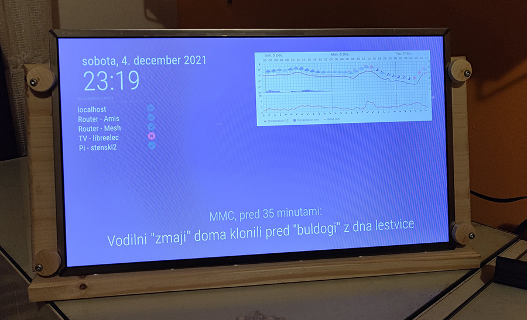
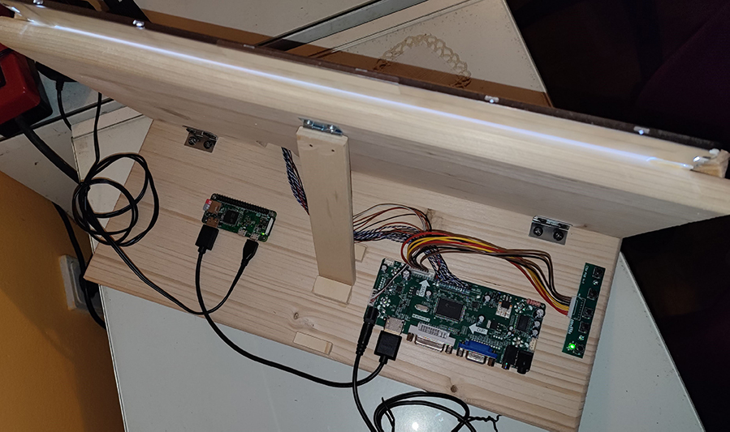
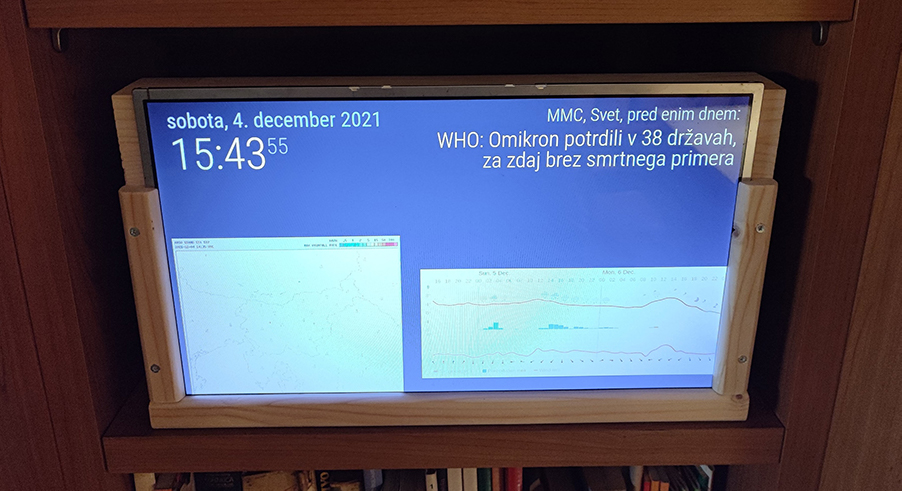

# MagicMirror_CustomDashboards

Mini project for "recycling" old laptop monitors using MagicMirror platform.

I had some old monitors scraped from non working or non used laptops that I wanted to use for some simple dashboards around the house.

## Hardware used
* scraped laptop monitor
* compatible LCD controller board + power adapter
* Raspberry Pi Zero WH + power adapter + SD card
* HDMI mini to HDMI adapter
* wood work for monitor stand

## Software used
* Raspberry Pi OS
* MagicMirror ([help instal using this tutorial](http://emmanuelcontreras.com/how-to/how-to-create-a-magic-mirror-2-with-pi-zero-w/))
* [bunch of MagicMirror modules](https://github.com/MichMich/MagicMirror/wiki/3rd-Party-Modules)

## Images

Dashboard #1

Dashboard #1 behind (components)

Dashboard #2 

